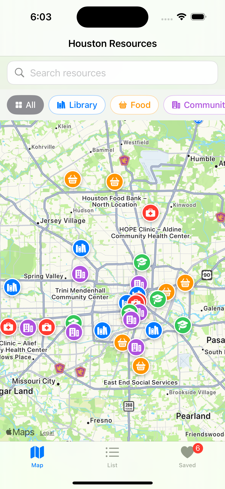
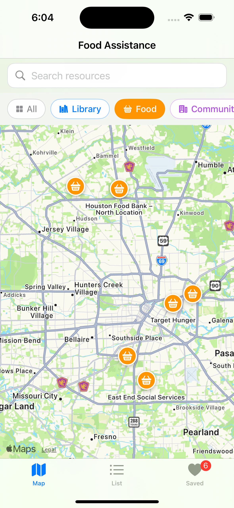
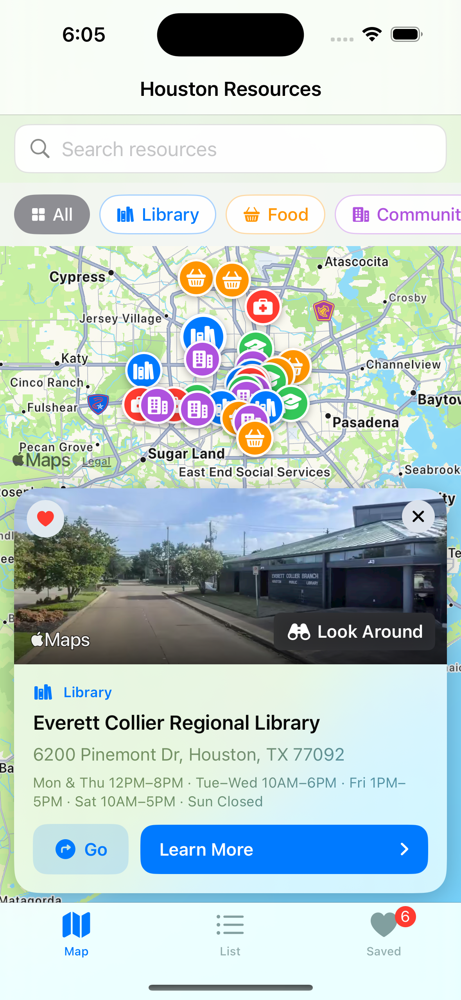
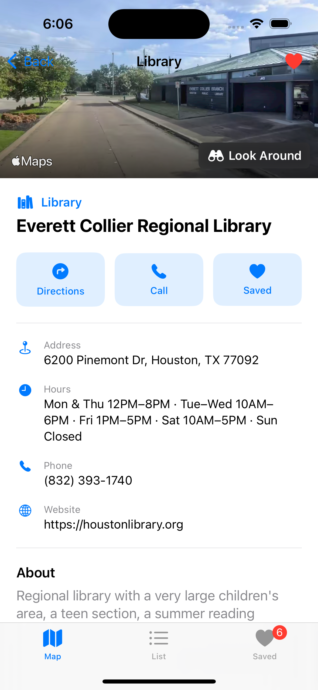
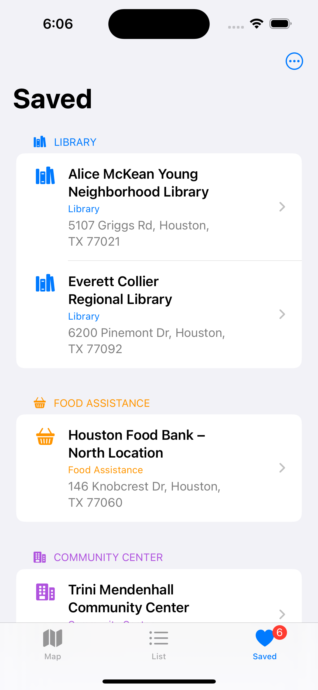

# Public Resource Finder

An iOS app that helps people in Houston find free and low-cost public resources — libraries, food assistance, community centers, health clinics, and education programs — on a map, with real addresses, hours, and phone numbers.

Built with SwiftUI and MapKit.

---

## The Problem

Houston has a large network of free public services. Most people who need them do not know they exist.

The information that does exist is scattered. Library hours live on the library system's site. Food pantry schedules live on individual nonprofit pages, some of which are only updated on Facebook. Clinic eligibility rules are buried in PDFs. Someone who has just lost a job, or who is new to the city, or who does not have reliable internet, has to already know what to search for before they can find anything.

That is the gap this app addresses: **not a shortage of services, but a shortage of visibility.**

The design assumes the user does not know the name of what they are looking for. They know what they need — food, a doctor, a quiet place to study — and roughly where they are. So the primary interface is a map, not a search box.

---

## Features

| Feature | Description |
|---|---|
| **Map view** | All 29 resources as color-coded pins across Houston |
| **Category filter** | Library, Food, Community, Health, Education — shared across tabs |
| **Full-text search** | Searches names, addresses, categories, **and service descriptions** |
| **Camera fly-to** | Selecting a search result animates the map to that location |
| **Detail card** | Tapping a pin slides up a card with a real photo of the location |
| **Detail page** | Full hours, phone, website, and a plain-language service description |
| **Directions** | Hands off to Apple Maps with drive, walk, or transit mode |
| **Favorites** | Saved resources persist across app launches, grouped by category |
| **Location imagery** | Real street-level photos via Apple Look Around, with fallbacks |

### Why search covers service descriptions

Searching only names would be close to useless here. A person does not search for "Healthcare for the Homeless — Caroline Street Clinic." They search for `dental`, or `free`, or `no insurance`.

Because the search index includes each resource's service description, queries like `GED`, `swimming pool`, `tax help`, and `sliding scale` all return useful results. This was the single highest-value decision in the project relative to how little code it took.

---

## Screenshots

## Screenshots

| Map | Filtered by category | Detail card |
|---|---|---|
|  |  |  |
| All 29 resources as color-coded pins | Food Assistance only | Look Around imagery of the location |

| Detail page | Saved |
|---|---|
|  |  |
| Hours, contact, directions, and services | Favorites grouped by category |

---

## Data

**29 resources across 5 categories**, collected July 2026:

| Category | Count | Examples |
|---|---|---|
| Library | 6 | Houston Public Library Central, Montrose, Collier Regional |
| Food Assistance | 6 | Houston Food Bank, Target Hunger, Second Servings |
| Community Center | 7 | Alief Neighborhood Center, SHAPE, Trini Mendenhall |
| Health Clinic | 5 | Healthcare for the Homeless, San José Clinic, HOPE Clinic |
| Education | 5 | BakerRipley campuses, Mission Milby, Harris County Dept. of Education |

Each entry stores: name, category, address, hours, phone, service description, website, and coordinates.

### A note on the word "free"

Several entries are **not strictly free**, and the app says so rather than hiding it.

- **San José Clinic** is low-cost, not free, and applies income eligibility.
- **HOPE Clinic** locations use a sliding fee scale based on household income.
- Some **BakerRipley** and **Mission Milby** programs are free; others are not, and availability changes seasonally.

Flattening these into "free" would have made the app cleaner and less honest. Someone who shows up expecting free care and gets a bill is worse off than someone who was told the truth up front. Each description states the actual cost model.

### Data limitations

- Hours are accurate as of **July 2026** and change without notice. Every detail page tells the user to call ahead.
- Five entries have no website listed, because no official URL could be verified. Rather than link to a plausible guess, the field is left empty and the app hides the link.
- Coverage is a representative sample, not an exhaustive directory. Houston has hundreds of qualifying sites.

---

## Tech Stack

- **Swift 5.9** / **SwiftUI**
- **MapKit** — map rendering, annotations, Look Around imagery, Maps handoff
- **UserDefaults** — favorites persistence
- **`@Observable`** (iOS 17 Observation framework) — shared app state
- **Xcode 15.2**, iOS 17.0 deployment target
- No third-party dependencies

---

## Architecture

```
PublicResourceFinder/
├── Resource.swift              Data model + category definitions
├── ResourceData.swift          The 29 resources
│
├── ContentView.swift           Tab bar; owns shared filter + favorites
│
├── MapView.swift               Map screen, pins, camera control
├── MapSearchBar.swift          Search field + results dropdown
├── CategoryFilterBar.swift     Filter chips (shared by map and list)
│
├── ResourceListView.swift      List screen + rows
├── ResourceCardView.swift      Bottom card shown on pin tap
├── ResourceDetailView.swift    Full detail page
├── ResourceImageView.swift     Look Around / satellite / gradient imagery
│
├── FavoritesStore.swift        Favorites state + persistence
├── FavoritesView.swift         Saved tab
└── DirectionsHelper.swift      Apple Maps handoff
```

State flows downward from `ContentView`, which owns both the category filter and the favorites store. The map and list tabs read the same filter, so switching tabs never loses context.

---

## Design Decisions

### 1. Look Around instead of scraped images

The obvious way to show a photo of each location is to download images from a search engine. Those images are copyrighted, and bundling them into a public repository is a real legal problem, not a theoretical one.

Instead, the app requests **Apple Look Around** imagery at each resource's coordinates. This is Apple's official street-level photography API, free to use in apps, and it returns an image of the actual address rather than whatever a name search happens to surface.

Where Look Around has no coverage, the app falls back to **satellite imagery** of the same coordinates, and finally to a category gradient. Nothing is bundled, nothing is downloaded, and there is no copyright exposure.

### 2. Favorites store IDs, not objects

`UserDefaults` holds an array of stable string IDs such as `"lib-central"`, not serialized resource objects.

This means updating a resource's hours or description does not invalidate anyone's saved list. On load, saved IDs are intersected with the IDs that currently exist, so a removed resource cannot leave a dangling favorite behind.

### 3. UserDefaults instead of Core Data

The persisted data is a set of short strings. Core Data or SwiftData would have added a schema, a migration story, and a container to manage, for no benefit at this scale. Choosing the smaller tool was the correct call.

### 4. Directions hand off to Apple Maps

iOS does not permit third-party apps to run turn-by-turn voice navigation. Every app that offers directions — including large commercial ones — hands off to a maps app. This app does the same, but lets the user pick drive, walk, or transit first, since a user without a car should not be handed a driving route by default.

### 5. Async image loading is tied to resource identity

An early bug: tapping a second pin without closing the first card left the previous location's photo on screen. SwiftUI had reused the view, so the `.task` never re-ran and the cached state persisted.

The fix binds the task to the resource ID (`.task(id: resource.id)`) and resets state at the start of each load. A `Task.isCancelled` check also discards results from in-flight requests that have been superseded, which prevents a slow response for an old pin from overwriting the current image.

---

## Running the Project

**Requirements:** macOS Ventura 13.5+, Xcode 15.2+, iOS 17.0+ simulator or device.

```bash
git clone https://github.com/jerrylion0726/PublicResourceFinder.git
cd PublicResourceFinder
open PublicResourceFinder.xcodeproj
```

Then press `⌘R`.

**To test directions in the Simulator**, set a location first:
`Features → Location → Custom Location` → latitude `29.7604`, longitude `-95.3698`

Without this the Simulator has no location and Maps cannot compute a route.

---

## Known Limitations

- **Data is static.** Resources are compiled into the app, so updating them requires a new build. A live data source would be the natural next step.
- **No user location on the map.** The app does not request location permission, so it cannot show "nearest to me" or sort by distance.
- **Hours are plain text**, not structured. The app cannot compute "open now."
- **English only**, which is a meaningful limitation in a city where many of these services are most needed by non-English speakers.
- **Houston only.**

---

## Possible Next Steps

1. **"Open now" indicator** — requires restructuring hours into machine-readable data.
2. **Sort by distance** — requires location permission and a distance calculation.
3. **Spanish and Vietnamese localization** — the two largest non-English language groups among the populations these services serve.
4. **Live data source** — pulling from a public API or maintained spreadsheet instead of a compiled file.
5. **Offline map caching** — the users most likely to need this app are the least likely to have reliable data.

---

## Disclaimer

This app is an independent student project. It is not affiliated with, endorsed by, or maintained in cooperation with any of the organizations listed.

Hours, services, and eligibility requirements change. **Always call ahead before visiting.**

---

## Author

Jerry Chen — [@jerrylion0726](https://github.com/jerrylion0726)
